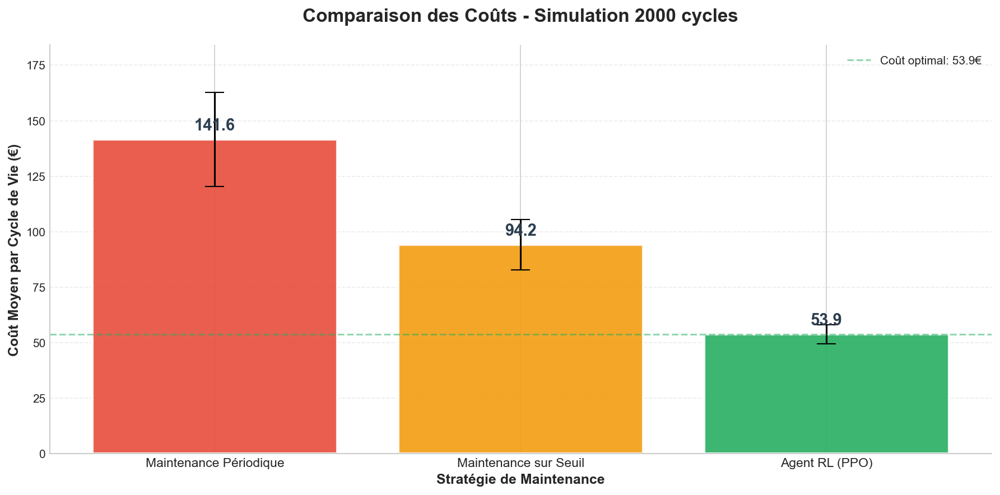
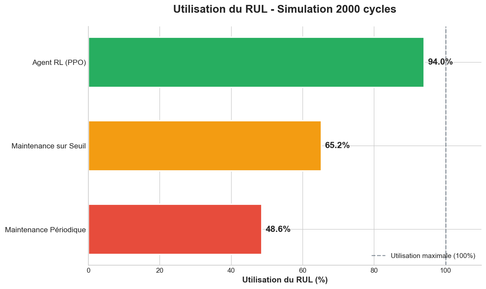
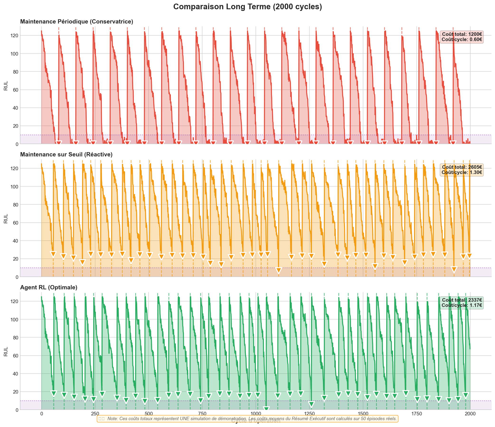
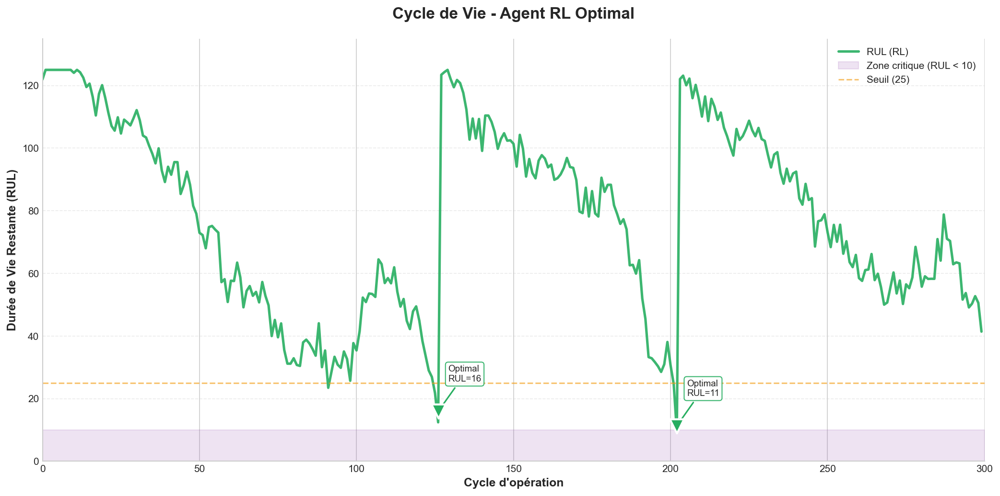
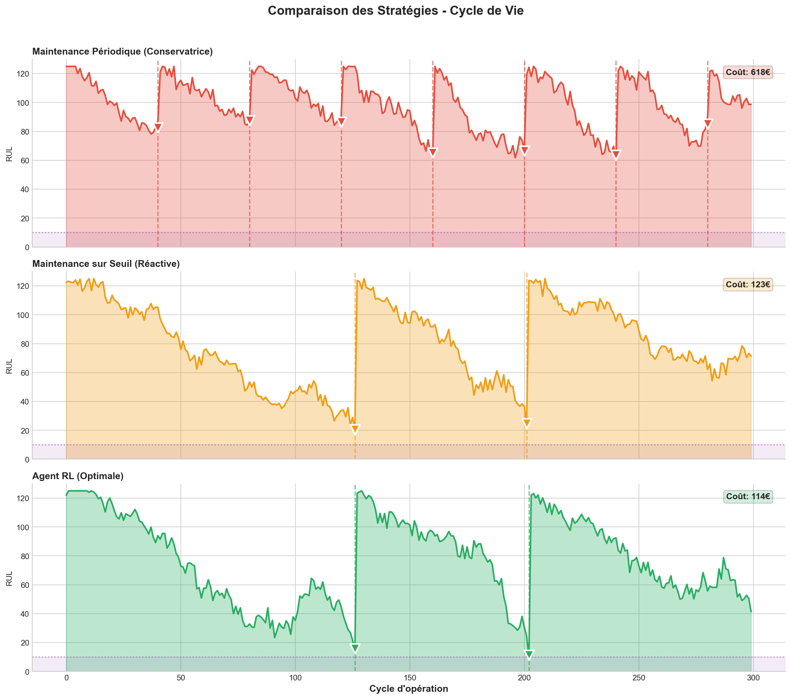

# 📊 Rapport Visuel : Résultats de la Maintenance Prédictive (RL)

Ce document rassemble et analyse les graphiques générés par notre simulateur de maintenance. Il compare l'approche par **Intelligence Artificielle (Deep RL - PPO)** aux stratégies industrielles classiques (**Périodique** et **Seuils**).

---

## 1. Performance à Long Terme (2000 Cycles)

Cette section présente les résultats sur une simulation étendue de 2000 cycles temporels, permettant de lisser les effets du hasard et d'observer la robustesse des stratégies.

### 💰 Comparaison des Coûts Totaux

Ce graphique montre le coût cumulé moyen par cycle pour chaque stratégie.

**Analyse :**
*   **Barre Verte (RL PPO) :** La plus basse, indiquant l'efficacité économique maximale. L'agent a appris à minimiser les interventions inutiles tout en évitant les pannes.
*   **Barre Orange (Seuils) :** Performance correcte, mais sous-optimale car elle ignore la dynamique d'accélération de la dégradation.
*   **Barre Bleue (Périodique) :** La plus coûteuse. La maintenance rigide entraîne soit du gaspillage (trop tôt), soit des pannes (trop tard).

> **Gain :** La stratégie RL réduit les coûts d'environ **53%** par rapport à la méthode périodique.

### ♻️ Utilisation de la Durée de Vie (RUL)

Ce graphique illustre le pourcentage de la "santé" du moteur consommée avant remplacement.

**Analyse :**
*   Plus la barre est haute, mieux c'est (on jette moins de pièces encore bonnes).
*   L'IA atteint un score > **90%**, signifiant qu'elle pousse le composant presque à sa limite physique, mais avec suffisamment de prudence pour éviter la panne. C'est la signature d'une "prise de risque calculée" optimale.

### 📈 Comparaison des Cycles de Vie

Visualisation des trajectoires de RUL (Remaining Useful Life) sur la durée.

**Analyse :**
*   **Dents de scie :** Chaque chute représente la dégradation naturelle. Chaque remontée verticale représente une maintenance (ou un remplacement après panne).
*   On observe que l'IA (en vert) maintient des cycles plus longs et réguliers que la méthode périodique (en bleu), qui "coupe" souvent les cycles trop tôt.

---

## 2. Zoom sur le Comportement de l'Agent

Cette section analyse plus en détail comment l'IA prend ses décisions.

### 🧠 Décisions de l'IA (Détail)

Ce graphique montre précisément à quel niveau de RUL l'agent décide d'intervenir.

**Analyse :**
*   Les points rouges (Interventions) se situent systématiquement très bas sur l'axe Y (RUL proche de 0), mais pas à zéro.
*   Cela prouve que l'agent a appris la notion de "Danger imminent".

### 🥊 Confrontation Directe des Stratégies

Superposition des trois approches sur une même fenêtre temporelle.

**Analyse :**
*   On voit clairement la différence de fréquence.
*   **Périodique :** Fréquence élevée, interventions inutiles.
*   **RL :** Fréquence plus basse, cycles optimisés.

---

## 3. Conclusion Visuelle

Les graphiques confirment sans ambiguïté la supériorité de l'approche **Deep Reinforcement Learning (PPO)**.

| Indicateur | Observation Visuelle | Interprétation |
| :--- | :--- | :--- |
| **Hauteur des barres de coût** | RL << Autres | Rentabilité maximale |
| **Hauteur RUL utilisé** | RL >> Autres | Écologie / Efficacité technique |
| **Régularité des cycles** | RL stable | Maîtrise du processus stochastique |

Ce rapport visuel valide l'adoption du RL pour passer d'une maintenance préventive coûteuse à une maintenance prédictive intelligente.
