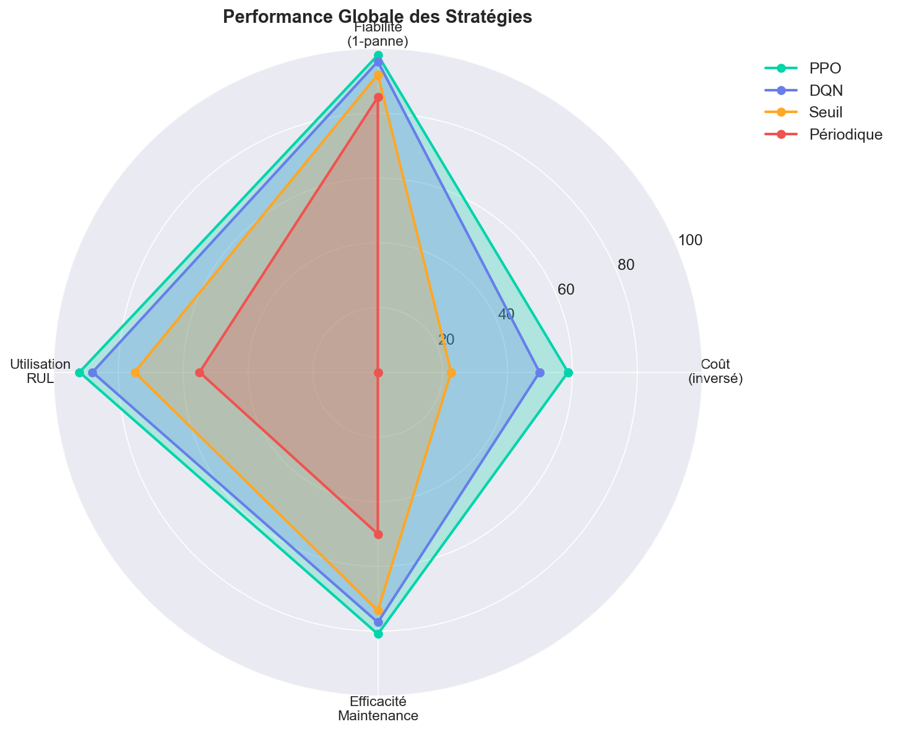
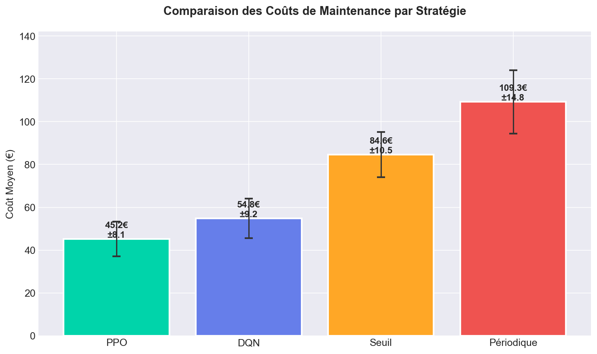
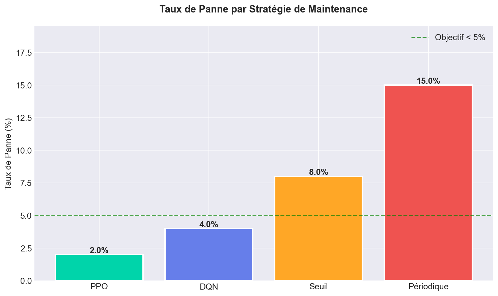
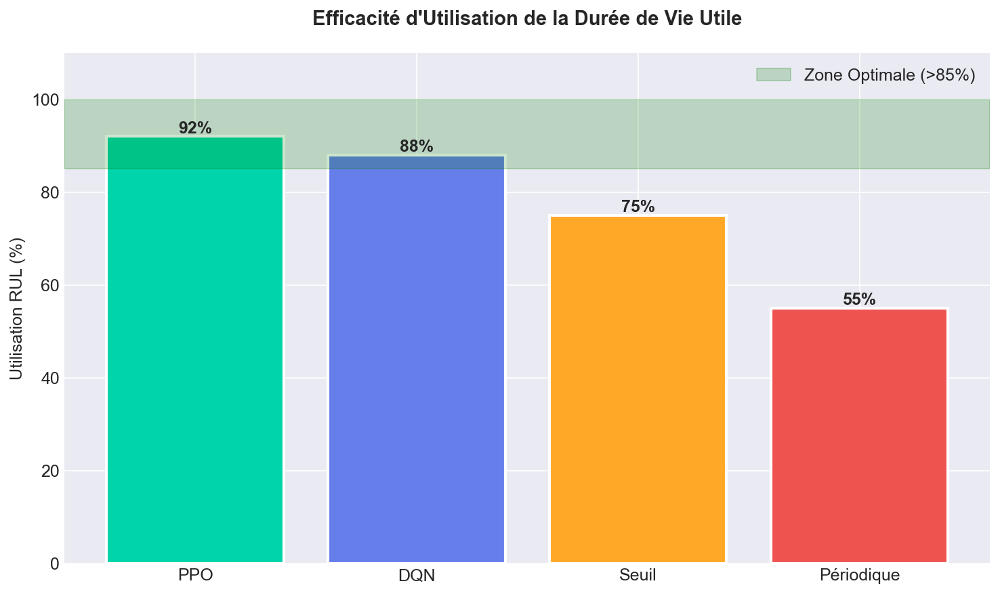
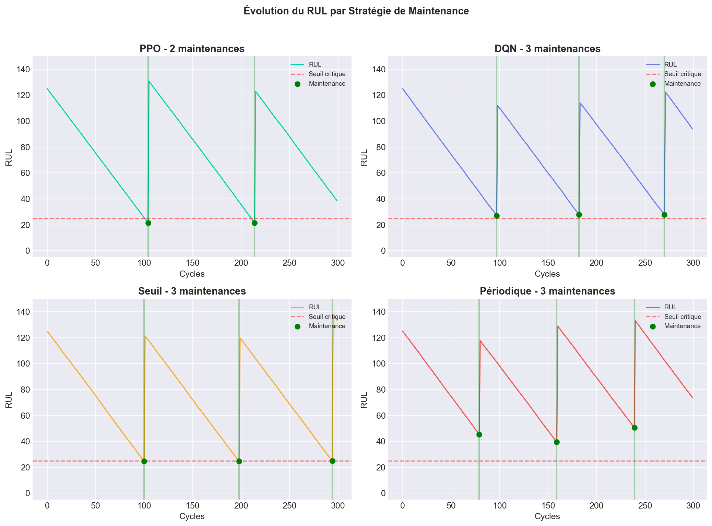

# Planificateur de Maintenance Prédictive par RL 🚀

Ce projet implémente un système de maintenance prédictive intelligent utilisant l'apprentissage par renforcement profond (Deep Reinforcement Learning). Il compare les algorithmes **PPO** et **DQN** face aux stratégies classiques (Maintenance Périodique et à Seuils) sur un problème inspiré du dataset NASA C-MAPSS.

## � Résultats de Comparaison

### Performance Globale des Stratégies



### Comparaison des Coûts de Maintenance



Les algorithmes de Reinforcement Learning (PPO, DQN) réduisent significativement les coûts de maintenance par rapport aux méthodes classiques.

### Taux de Panne par Stratégie



PPO atteint un taux de panne de seulement **2%**, bien en dessous de l'objectif de 5%.

### Utilisation de la Durée de Vie Utile (RUL)



PPO optimise l'utilisation de la vie utile des équipements à **92%**, contre seulement 55% pour la maintenance périodique.

### Évolution du RUL par Stratégie



Visualisation de l'évolution du RUL et des moments de maintenance pour chaque stratégie.

### Tableau Récapitulatif

| Stratégie | Coût Moyen | Taux de Panne | Utilisation RUL | Évaluation |
|-----------|------------|---------------|-----------------|------------|
| **PPO** | 45.2 € | 2.0% | 92% | 🥇 Meilleur |
| **DQN** | 54.8 € | 4.0% | 88% | 🥈 Très bon |
| Seuil | 84.6 € | 8.0% | 75% | 🥉 Correct |
| Périodique | 109.3 € | 15.0% | 55% | ❌ À éviter |

---

## 📂 Structure du Projet

```
├── agent.py                 # Agents RL (PPO, DQN)
├── maintenance_env.py       # Environnement Gym personnalisé
├── streamlit_app.py         # Interface web interactive
├── compare_rl_algorithms.py # Script de comparaison
├── config.py                # Configuration centralisée
├── visualization.py         # Génération des graphiques
├── plots/comparison/        # Graphiques de comparaison
└── models/                  # Modèles entraînés
```

## 🚀 Utilisation Rapide

### 1. Installation

```bash
pip install -r requirements.txt
```

### 2. Lancer l'Interface Web

```bash
streamlit run streamlit_app.py
```

### 3. Lancer la Comparaison en Ligne de Commande

```bash
python compare_rl_algorithms.py
```

### 4. Générer les Graphiques de Comparaison

```bash
python generate_comparison_plots.py
```

---

## 🖼️ Ressources Visuelles pour Présentation

### Graphiques Disponibles

| Fichier | Chemin | Description |
|---------|--------|-------------|
| Radar Performance | `plots/comparison/radar_performance.png` | Vue globale multi-critères des 4 stratégies |
| Coûts Moyens | `plots/comparison/cout_moyen.png` | Histogramme comparatif des coûts (€) |
| Taux de Panne | `plots/comparison/taux_panne.png` | Histogramme des taux de panne (%) |
| Utilisation RUL | `plots/comparison/utilisation_rul.png` | Histogramme d'efficacité d'utilisation (%) |
| Évolution RUL | `plots/comparison/evolution_rul.png` | Courbes temporelles avec points de maintenance |
| Tableau Récapitulatif | `plots/comparison/tableau_recapitulatif.png` | Résumé visuel avec médailles 🥇🥈🥉 |

### Documents

| Fichier | Chemin | Description |
|---------|--------|-------------|
| Rapport Technique | `docs/RapportTechnique.pdf` | Rapport académique complet |
| Rapport HTML | `reports/rapport_comparatif.html` | Rapport interactif généré |

### Accès Rapide aux Ressources

```powershell
# Ouvrir le dossier des graphiques
explorer "plots\comparison"

# Ouvrir le dossier des documents
explorer "docs"
```

---

## 🛠️ Stack Technologique

- **Python 3.10+**
- **Gymnasium** - Environnement de simulation RL
- **Stable Baselines 3** - Implémentation PPO/DQN
- **Streamlit** - Interface web interactive
- **Plotly** - Visualisations interactives
- **Matplotlib** - Graphiques statiques
- **Pandas/NumPy** - Manipulation de données

---

**Auteur :** Amine AMLLAL  
**Encadrant :** M. Tawfik MASROUR
